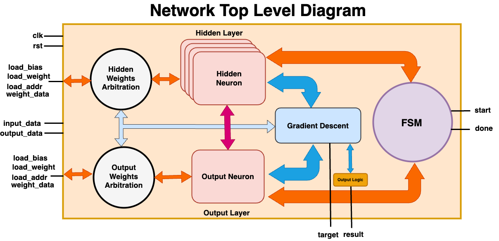
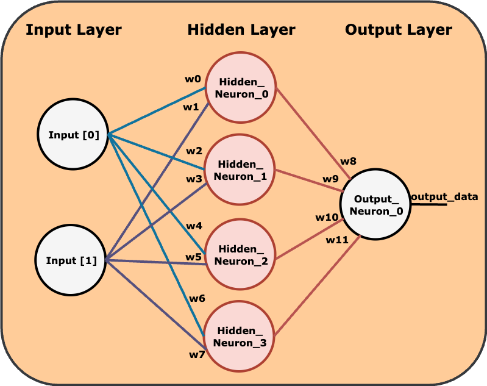
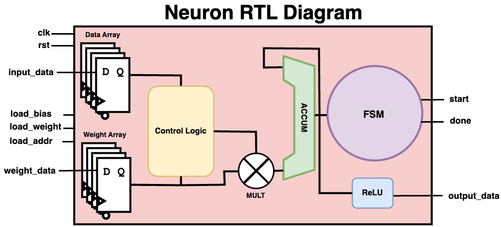

# XOR-NOMADNN

## Introduction
This repository serves as documentation for a DNN implementation based on the Multi-Layer Perceptron architecture, which can be used to learn any 2-input boolean function, such as an XOR operation.

  

I started this project because I wanted to improve my understanding of machine learning and to gain some experience in designing DNN accelerators in VHDL. I selected a MLP architecture particularly because it is a simple but efficient architecture and the basis of neural networks. Initially, I created an MLP neural network using the numpy library in Python to simulate and train the network as a proof of concept. The weights generated by a fully trained network can be used as a starting point for our accelerator. In my research of DNNs, I've come across two predominant methodologies: (1) utilizing pre-trained weights for inference, and (2) combining inference with backpropagation for weight adjustment. In the first scenario, the accelerator relies on pre-trained weights to execute inference tasks. In the second scenario, it engages in inference and then in backpropagation to correct errors within the network. This project will focus on implementating scenario 2, which will occur as a 2-stage process: "forward pass" and "backward pass". 

## Network Design
The best way to understand the purpose of this project is by visualizing the neural network through an abstracted diagram.:

    

The diagram showcases the network's 3-layer architecture, starting with the input layer, which is where our data enters the system. The hidden layer is where the network begins to process the data through interconnected neurons linked to each input node by a weight. Finally, the output layer consists of a single neuron, which gives us the final result. Since the result will be non-binary, we would have to add some additional logic to interpret our result.

## Neuron Design

    

The diagram showcases the neuron architecture with components corresponding to:

- `Data Array`: Represents the input vector `x`.
- `Weight Array`: Stores the weights `W` and bias `b`.
- `Control Logic`: Manages state transitions and data flow.
- `FSM`: Orchestrates the sequence of operations.
- `ACCUM`: Accumulates the weighted inputs `z`.
- `MULT`: Multiplies inputs by their weights.
- `ReLU`: Activation Function `z`.

The operations performed by the neuron can be mathematically expressed as:

`for n = NUM_IN-1:` 

$$ z = \sum_{{i=0}}^{{n}} W_i x_i + b_i $$

Where`NUM\_IN`represents the number of inputs our neuron will process. In our design, there are two inputs per neuron for the hidden layer neurons and four inputs for our output layer neuron. A hidden neuron calculation can then be expressed like this: 

$$ z^{(i)} = W^{(i)}[1] \cdot x[1] + W^{(i)}[0] \cdot x[0] + b^{(i)} $$

Here, the ACCUM output is fed through the ReLU activation function, which is denoted by`a^{(i)} $: 

$$ a^{(i)} = ReLU(z^{(i)}) $$

The [Rectified Linear Unit (ReLU)](https://www.nomidl.com/deep-learning/what-is-relu-and-sigmoid-activation-function/) function was selected due to the fact that it is easy to implement in VHDL and provides non-linear characteristics to our circuit. This leads to model sparsity, which is marked by inactive neurons and can improve the models predictive power.  

$$ ReLU(x)=max(0,x) $$

    

## Learning Principle

The algorithm that we use to correct the error in each layer is known as gradient descent, a powerful tool for minimizing error within each layer of our neural network. After the forward pass stage, we quantify the error for each neuron in the output layer: 

`for j in 0 to OUTPUT_NEURONS-1:` 

$$ δ^{(j)}_{2} = y - t $$

Where`y` is the output vector and `t` is the target vector, introduced during training. The hidden layer error can then be calculated as follows:

`for i in 0 to HIDDEN_NEURONS-1:`

$$ δ^{(i)}_{1} = {W_2}^{T} \cdot δ_2^{(j)} ⊙ a^{`}(z^{(i)}) $$

Where `W2` denotes the transposed weight matrix for the hidden to output layer connections, and `a′i`is the derivative of the activation function given the weighted sum input. Now that we know the error, we proceed to update the weights associated with each connection: 

#### Hidden-Output Layer Weights and Biases:

$$ {W^{2}} = {W^{2}} − η \cdot δ^{(j)}_{2} \cdot (aj)^{T} $$

$$ {b^{2}} = {b^{2}} − η \cdot δ^{(j)}_{2} $$

#### Input-Hidden Layer Weights and Biases:

$$ {W^{1}} = {W^{1}} − η \cdot δ^{(i)}_{1} \cdot (x)^{T} $$

$$ {b^{1}} = {b^{1}} − η \cdot δ^{(i)}_{1} $$

Where`η`is the learning rate, which controls how much the weights are adjusted during each update.

